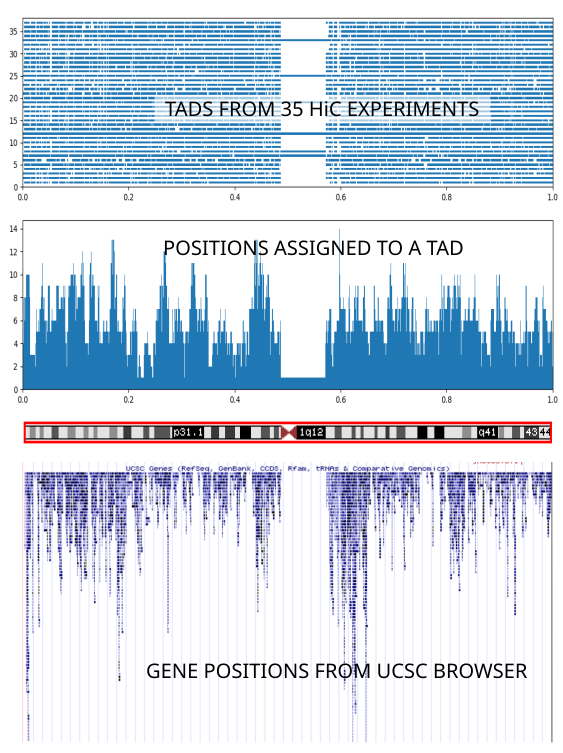

# Progesterone

This is a set of scripts that try to answer the question: is it possible that a gene A 
is under control of transcription  factor B, given currently available experimental 
evidence. Response to progesterone and estrogen was the original topic.

_Progesterone_ is not a library  - the scripts are loosely connected by a couple of common methods 
in the utils module. They average some hundred lines in length, and can
probably be figured out without much explanation. 
They have been tested to run under python 3.6.6, and are supposed 
to be run in the  order in which they are enumerated. They answer a series of 
sub-questions, which may add up to an answer. Depends on the answer you are hoping for.

<!-- this is a comment -->
<!-- making TOC: https://github.com/ekalinin/github-markdown-toc -->
<!-- once installed, use with gh-md-toc README.md    -->
 
## Table of Contents
* [Table of Contents](#table-of-contents)
* [Dependencies](#dependencies)
* [Gene coordinates](#gene-coordinates)
* [What's with this TAD business](#whats-with-this-tad-business)
* [Which TAD does my gene belong to](#which-tad-does-my-gene-belong-to)
* [Where do transcription factors bind within that TAD](#where-do-transcription-factors-bind-within-that-tad)
   * [ENCODE information in UCSC](#encode-information-in-ucsc)
   * [ChIPSeq from local bed files](#chipseq-from-local-bed-files)
      * [BED format](#bed-format)
      * [Assembly](#assembly)
* [How are TF binding sites distributed across TADs](#how-are-tf-binding-sites-distributed-across-tads)
* [Where exactly (and and how good) is the TF binding motif within each ChIPSeq region](#where-exactly-and-and-how-good-is-the-tf-binding-motif-within-each-chipseq-region)
* [Which regions within the TAD  come  in contact (and how often)](#which-regions-within-the-tad--come--in-contact-and-how-often)
* [Change in chromatin accessibility upon progesterone administration?](#change-in-chromatin-accessibility-upon-progesterone-administration)
* [Putting it all together](#putting-it-all-together)
* [So, functional TF sites or not?](#so-functional-tf-sites-or-not)
* [TODO](#todo)

 
## Dependencies

_Progesterone_ pipeline depends on several data sources and python packages. You don't have to
install them right away but only (or when) they become necessary. 
* [collection of TADs from Yue lab](http://promoter.bx.psu.edu/hi-c/publications.html)

* [UCSC genome database, accessed directly through MySQL](https://genome.ucsc.edu/goldenpath/help/mysql.html)

* MySQLdb python module, installed with _sudo apt install python3-mysqldb_. _Progesterone_ scripts 
also count on mysql configuration  somewhere at the top of the current
user's directory tree. Here it is called '.ucsc_mysql_conf'  and looks like this:

`[client]`   
`skip-auto-rehash`  
`user = genome`  
`host = genome-mysql.soe.ucsc.edu`  
`port = 3306`

* data from HiC experiment on [... something](https://www.encodeproject.org/experiments/ENCSR551IPY/) - 
  adapt this to the cell/tissue type you are interested in
  
* ChIPSeq regions from ENCODE experiment, [collected in UCSC genome db](http://hgdownload.cse.ucsc.edu/goldenpath/hg19/encodeDCC/wgEncodeRegTfbsClustered/)

* [CrossMap](http://crossmap.sourceforge.net/) for transforming coordinates to a single reference assembly 
  (together with transformation chain files, [here](http://crossmap.sourceforge.net/#chain-file))

* [Gnuplot](http://www.gnuplot.info/)

* Matplotlib  python module (_pip3 install matplotlib_; 
if your scripts complain about missing tkinter, you might also have to do
_sudo apt install python3-tk_)

* python [tools](https://www.h5py.org/) for handling data in [HDF5 format](https://portal.hdfgroup.org/display/support)

* transcription factor (TF) binding motif databases [JASPAR](http://jaspar.genereg.net/) and 
   [Hocomoco](http://hocomoco11.autosome.ru/)

* [Motif](http://biopython.org/DIST/docs/api/Bio.motifs-module.html) 
  from [Biopython](https://biopython.org/)

* more ChIPSeq data from [GEO](https://www.ncbi.nlm.nih.gov/geo/) database ([GSE34927](https://www.ncbi.nlm.nih.gov/geo/query/acc.cgi?acc=GSE34927),
 [GSE36455](https://www.ncbi.nlm.nih.gov/geo/query/acc.cgi?acc=GSE36455), for example. Again YMMV.)
 
* maf_parse from [PHAST](http://compgen.cshl.edu/phast/)

* Multiple alignment files (mafs) from UCSC for 
[mouse](http://hgdownload.soe.ucsc.edu/goldenPath/mm9/multiz30way/maf/) and 
[human](http://hgdownload.soe.ucsc.edu/goldenPath/hg19/multiz100way/maf/) - 
these are voluminous  and optional. If you
know the chromsome your gene resides on, you can download maf(s) for that chromosome only.
 
 * for output, the pipeline expects to see a provided (output) directory structure like this:
 <pre>
 raw_data/
├── alignments_human
├── alignments_mouse
├── chipseq_regions_human_seqs
├── chipseq_regions_mouse_seqs
├── chromatin_opening.tsv
├── hic_interactions
├── tad_distributions
├── tads
├── tf_binding_sites_database1
├── tf_binding_sites_database2
 results/
 </pre>
 If a (sub)directory is nonexistent, each script will prompt you to create it as necessary. 
 Feel free to change the scripts  if you would like to organize things differently.

## Gene coordinates
You may start by downloading chromosome lengths and gene coordinates from UCSC using 
[01_chromosome_lengths_from_UCSC.py](01_chromosome_lengths_from_UCSC.py) 
and [02_gene_ranges_from_UCSC.py](02_gene_ranges_from_UCSC.py), 
or you can download them later, when they become needed.

## What's with this TAD business

With 2 meters of DNA squished  in the nucleus with 6 micrometres in diameter, we expect 
that the packing is quite complex. What we know in addition, is that 
the packing is not random. Rather, the genetic material is organized into domains, 
[TADs](https://en.wikipedia.org/wiki/Topologically_associating_domain),
that stay localized in space, even as they  keep rearranging internally, and switching their positions within the nucleus, reviewed in 
[Merkenschlager & Nora](https://www.researchgate.net/profile/Elphege_Nora/publication/301482856_CTCF_and_Cohesin_in_Genome_Folding_and_Transcriptional_Gene_Regulation/links/5726c5b508ae262228b21511/CTCF-and-Cohesin-in-Genome-Folding-and-Transcriptional-Gene-Regulation.pdf).
The implication would be that any transcription factor (TF) binding site therein is potentially regulating
any (or all) genes therein. This means that we can look for the regulating TF binding sites as far as ~MBp away from 
the promoter, an idea that would be an anathema half a decade back. In addition it opens a happy possiblity that genes 
are not under a single TF site control, but under control of a number of them, in a stochastic way, with
the probablity of TF having an effect being proportional to the number of TF binding sites in a TAD.

Where on the chromosome, then, is the TAD that my gene belongs to?
The idea repeatedly appears in the literature that TAD boundaries are conserved across cell types and species
(for example, [Dixon _et al_ review, Moll Cell 2016](https://www.ncbi.nlm.nih.gov/pmc/articles/PMC5371509/)). 
That would be useful, beacuse with unversal definetion of TADs  we could write very many scripts with very many 
purposes, having looked up the TAD definition only once.

 [10_tads_overview.py](10_tads_overview.py) explores that possibility  - with mixed results.

You will need to download TAD files from the [Yue lab page](http://promoter.bx.psu.edu/hi-c/publications.html) 
 (we suggest  sticking with hg19 throughout the pipeline  - use link named 'TADs in  hg19'). 
 Adjust the dirpath in  [10_tad_overview.py](10_tad_overview.py) accordingly. This script groups TAD intervals 
 that appear repeatedly in different experiments, in the hope of finding those
 that are supposedly conserved across different cell types. It seems that one could make some progress
 looking for regions that are rarely assigned to a domain, and thus delineate the topmost division in a 
 TAD hierarchy. The number of these divisions, however, appears to be an order of magnitude smaller
 than the number of TADs typically reported in each experiment.
 
 [11_tads_pic.py](11_tads_pic.py) contains basic code to illustrate  the reported TAD domains. 
 It uses [Matplotlib](https://matplotlib.org/); note that in Matplotlib you can zoom 
 into any region of the graph you are interested in. 
 Here are the TADS for human chromsome 1, from 35 different experiments from the Yue lab collection:
 

 
 The whole chromosome length has been rescaled to the range [0,1].
If you squint a little you can see that the basic TAD  structure corresponds to the regions of densest
gene occupation region (middle and bottom panels) -  careful with the interpretation of this graph: see 
[11_tads_pic.py](11_tads_pic.py):plot_2()). However the individual TAD assignments 
(top panel; each horizontal level corresponds to one experiment) 
vary widely between different experiments. Therefore we choose to stick with a single experiment
([Homo sapiens endometrial microvascular endothelial cells](https://www.encodeproject.org/experiments/ENCSR551IPY/))
because the  cell type it uses  matches most closely the type of cells we are interested in.

Caveat: on some OS/graphics card setups [11_tads_pic.py](11_tads_pic.py) may crash. It is the matter
of Matplotlib rather than the script itself. 

## Which TAD does my gene belong to
Provided you have downloaded gene ranges using [02_gene_ranges_from_UCSC.py](02_gene_ranges_from_UCSC.py) and installed bed file containig
 definition of TADs you wnat to stick with 
 (this pipeline originally used [this](https://www.encodeproject.org/files/ENCFF633ORE/)),
  [12_emve_tads.py](12_emve_tads.py) will find the
 coordinates of the TAD that your gene belons to.

## Where do transcription factors bind within that TAD

Note: in all cases we are actually looking at 
[ChIPSeq](https://en.wikipedia.org/wiki/ChIP-sequencing)
regions, which are much larger than the
actual TF binding site. We will narrow down each of these regions later in the pipeline.

### ENCODE information in UCSC

[14_tf_binding_sites_from_UCSC.py](14_tf_binding_sites_from_UCSC.py) will download ChIPSeq information 
from [ENCODE](https://www.encodeproject.org/)
deposited in [UCSC](https://genome.ucsc.edu/encode/). The contents of the relevant database table
are described [here](http://rohsdb.cmb.usc.edu/GBshape/cgi-bin/hgTables?hgta_doSchemaDb=hg19&hgta_doSchemaTable=wgEncodeRegTfbsClusteredV3).
This information relates to human only. Also some TFs are notably absent - progesterone for example :}.

[15_tfbs_UCSC_sources.py](15_tfbs_UCSC_sources.py) will output the contents of the table 
informatively named 
[wgEncodeRegTfbsClusteredInputsV3](http://rohsdb.cmb.usc.edu/GBshape/cgi-bin/hgTables?hgta_doSchemaDb=hg19&hgta_doSchemaTable=wgEncodeRegTfbsClusteredInputsV3).
This is the closest yours truly could get to finding the actual information about the ENCODE experiments 
behind each ChIPSeq entry. At this point, to get the actual ENCODE experiment ID you will have to get creative on the
ENCODE search page and use the combined search on cell type and treatment or some such.
Note that the experiment numbers output here refer to the expNum field in the tables 
produced by [14_tf_binding_sites_from_UCSC.py](14_tf_binding_sites_from_UCSC.py).

### ChIPSeq from local bed files

For description of bed format click [here](https://genome.ucsc.edu/FAQ/FAQformat.html#format1).

[16_tfbs_from_local_bed.py](16_tfbs_from_local_bed.py) will produce equivalent output to 
[14_tf_binding_sites_from_UCSC.py](14_tf_binding_sites_from_UCSC.py), but starting from a local
list of bedfiles (the files should refer to ChIPSeq experiments, and can be found 
on [GEO](https://www.ncbi.nlm.nih.gov/geo/)
and [ENCODE](https://www.encodeproject.org/) pages, for example, or you may use your own source.)
[16_tfbs_from_local_bed.py](16_tfbs_from_local_bed.py) will take as the input on the command line the
path to the data directory  and 
[tsv](https://en.wikipedia.org/wiki/Tab-separated_values) table containing some basic input file meta-data.

The data directory should preferably contain  bed files, grouped by experiment id, like this:

<pre>
├── GSE36455
│   ├── GSE36455_series_matrix.tsv
│   ├── GSM894053_WT_vehicle.ER_peaks.bed
│   ├── GSM894054_WT_E2.ER_peaks.bed
│   └── README
└── GSE62475
    ├── GSE62475_series_matrix.tsv
    ├── GSM1527528_pgra-v-input-macs_peaks.bed
    ├── GSM1527529_pgrb-v-input-macs_peaks.bed
    └── README
</pre>

The tsv should contain tab separated  columns of the form
`organism | gene name	| TF name | experiment id | agonist file bed | control/vehicle file bed | assembly`.
Control file is optional -  but the control peaks will be subtracted from the peaks in the presence of agonist, 
if available.

There are some special considerations to be taken in account here:

#### BED format

 [16_tfbs_from_local_bed.py](16_tfbs_from_local_bed.py) expects "bed" format, which here means that the columns are tab separated, the
first column is chromosome number (possibly prefixed by 'chr'), and the following two are
region start and region end. The format is still not universally accepted as the standard, so in GEO for
example you can find data deposited in assorted _ad hoc_ formats.  If the file is not
too far from that format, you can perhaps help yourself out with 
[linux _cut_ command](https://www.thegeekstuff.com/2013/06/cut-command-examples/), 
see also 
[here](https://unix.stackexchange.com/questions/35369/how-to-define-tab-delimiter-with-cut-in-bash) 
for tab delimiter handling with _cut_. For example

`cut -d$'\t' -f3-5  GSM857545_1_PR_oil_s_4_aligned.tsv > GSM857545_1_PR_oil_s_4_aligned.bed`

#### Assembly

_Progesterone_ pipeline takes hg19 and mm9  as its reference assemblies. 
In GEO repositories there is usually a file called *_series_matrix.txt 
(which is actually a tsv file), where this info can be found. 
You may grep for hg or mm to see which one is referred to. If it is not hg19 for human
or mm9 for mouse, the coordinates need to be translated.
 (In Windows you might try using a spreadsheet program to reformat the file. Just make sure
 you do not have too many  in your bed file). Include that information in the table you pass to 
 [16_tfbs_from_local_bed.py](16_tfbs_from_local_bed.py) and it will translate the coordinates for you,
 provided the following two resources: [CrossMap](http://crossmap.sourceforge.net/), a copy of
 which is included in this distribution in the [utils directory](utils/CrossMap.py), 
 and [transformation chain files](http://crossmap.sourceforge.net/#chain-file)). The script will
 inform you if it cannot find these files in the place where it expects them.
 

## How are TF binding sites distributed across TADs

Is the TAD that contains 'my' gene  privileged in the number of TF binding sites (of some particular TF) 
it harbors, or are the TF binding sites perhaps distributed equally across all TADs? The latter case
 might imply that the TF binding sites we are finding are just distributed by some random process - this
would raise an awkward possibility that we are  just looking at noise.

[17_tfbs_distribution.py](17_tfbs_distribution.py) counts the number of TF binding sites for each TAD. 
For Gnuplot users, an input like [18_tfbs_distribution.gplt](18_tfbs_distribution.gplt) can be used to produce
a quick and dirty visualization of the TFs-per-TAD histogram. The output from [17_tfbs_distribution.py](17_tfbs_distribution.py) can also be used to check correlation
between TAD length and the number of TF binding sites therein (mercifully, there does not seem to be any).

## Where exactly (and and how good) is the TF binding motif within each ChIPSeq region

[20_motif_finder_exercise.py](20_motif_finder_exercise.py) illustrates basic usage of a 
[position  weight matrix](https://en.wikipedia.org/wiki/Position_weight_matrix) 
(courtesy of [JASPAR](http://jaspar.genereg.net/)) together with Motif from Biopython to find  a motif within a 
given range.

[22_motif_in_chipseq_region.py](22_motif_in_chipseq_region.py) will scan each chipseq range from a file produced 
by [14_tf_binding_sites_from_UCSC.py](14_tf_binding_sites_from_UCSC.py) 
or [16_tfbs_from_local_bed.py](16_tfbs_from_local_bed.py) and report all motifs scoring beyond certain cutoff.
For such motifs it will proceed to look for the alignment with other vertebrates. (The idea with using
all vertebrates is to see how far in back in the evolution the conservation can be tracked, or to eliminate motifs that are taxonomy branches that do not exhibit the same regulatory behavior;
you may go for pairwise alignments with smaller number od species.) Note: extracting the alignment from maf files
is a very slow process. You may turn it off in the first pass, or just choose not to use it at all, especially since 
the required maf files take a lot of space and long time to download.

## Which regions within the TAD  come  in contact (and how often)

HiC experiment we came across here have their results stored in 
[HDF5 format](https://portal.hdfgroup.org/display/support), so this is the place where you might want to install
[h5py](https://www.h5py.org/). We will investigate  what is the 'intensity' (a number proportional to the
probability that two HiC regions meet in time and space) of interaction between HiC region containing the promoter
of the regulated gene, and regions containing the TF binding sites.

[24_hdf5_exercise.py](24_hdf5_exercise.py) contains some warmup exercised in hdf5 file manipulation,  and
[25_hdf5_exercise2_normalization.py](25_hdf5_exercise2_normalization.py) checks whether the rows and columns
of the interaction matrix are normalized (or 'balanced'; 
see [Lajoie, Dekker and Kaplan](https://www.ncbi.nlm.nih.gov/pmc/articles/PMC4347522/)).

[26_chromatin_interactions_from_ENCODE.py](26_chromatin_interactions_from_ENCODE.py) will  create a mapping between
TF binding sites and HiC regions, sorted by the 'interaction strength' with the HiC region that contains the promoter 
of the regulated gene. The hardcoded paths at the top of the main() are kinda gross, fixing it is on the TODO list.

## Change in chromatin accessibility upon progesterone administration?

## Putting it all together

## So, functional TF sites or not?
Print the table you have just made, and take it to a competent experimentalist. 
(S)he might be able to help.

## TODO

Most of clunkyness in the pipeline comes from treating the UCSC and local info in different ways. 
Register any new data into a local database as the first step, perhaps removing the need for the
raw _data folder entirely.

Get rid of CrossModule.py and use cmmodule directly.